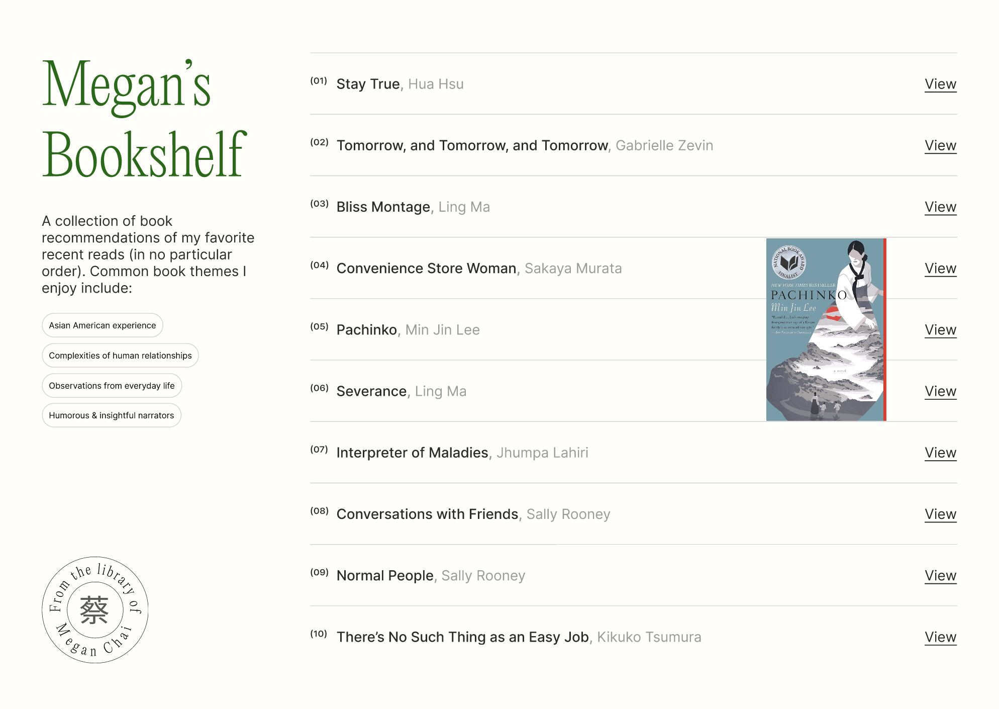
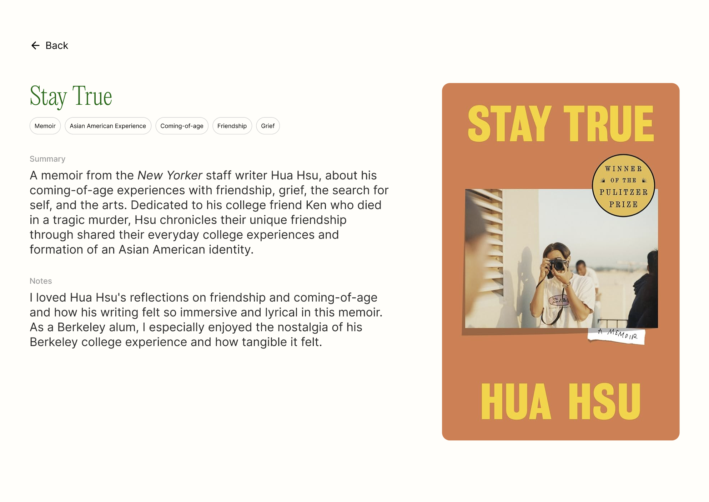
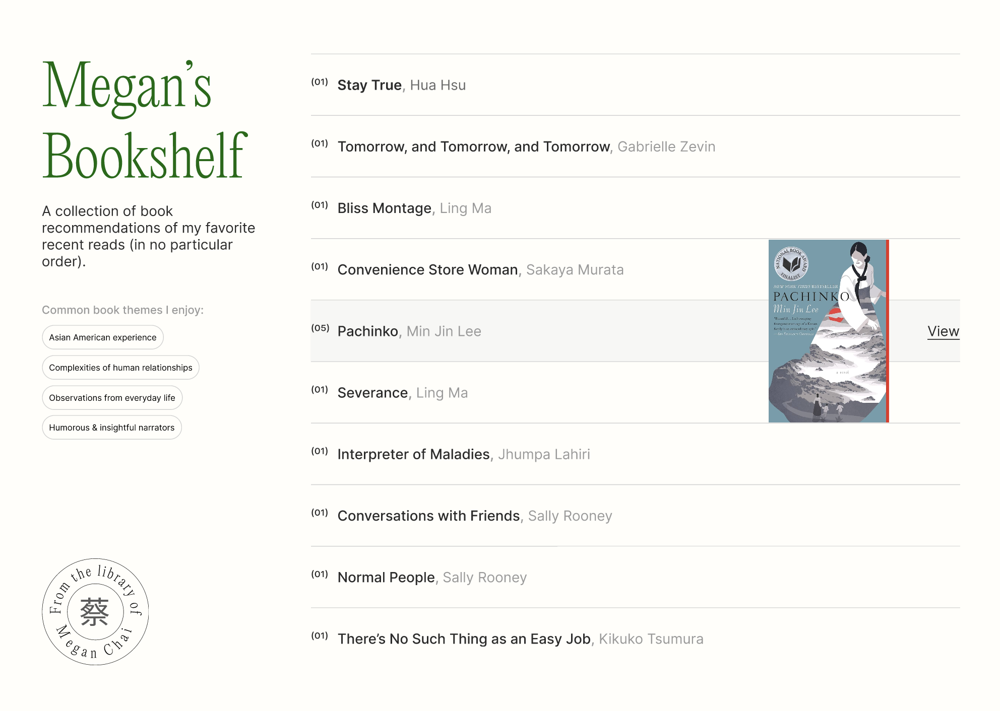
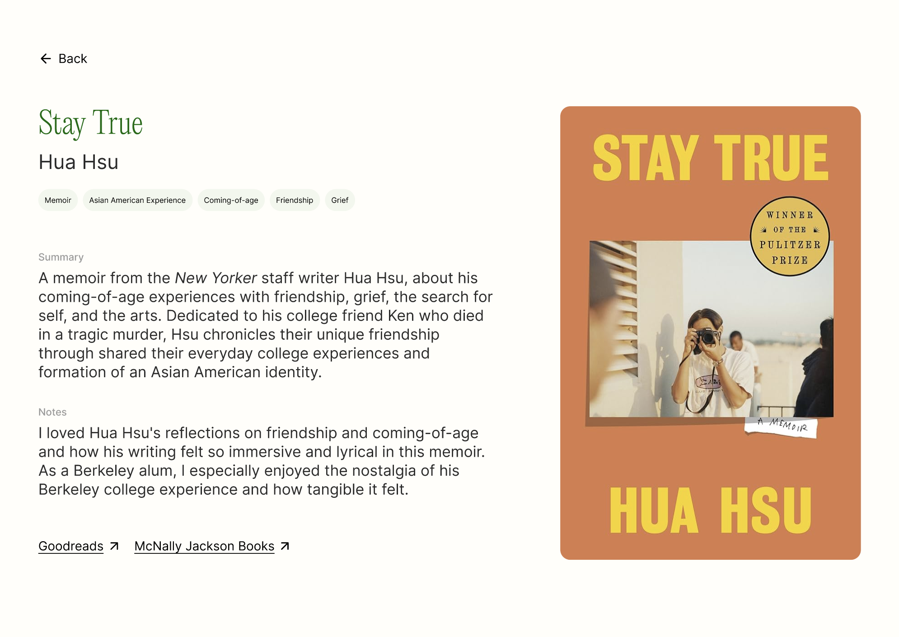
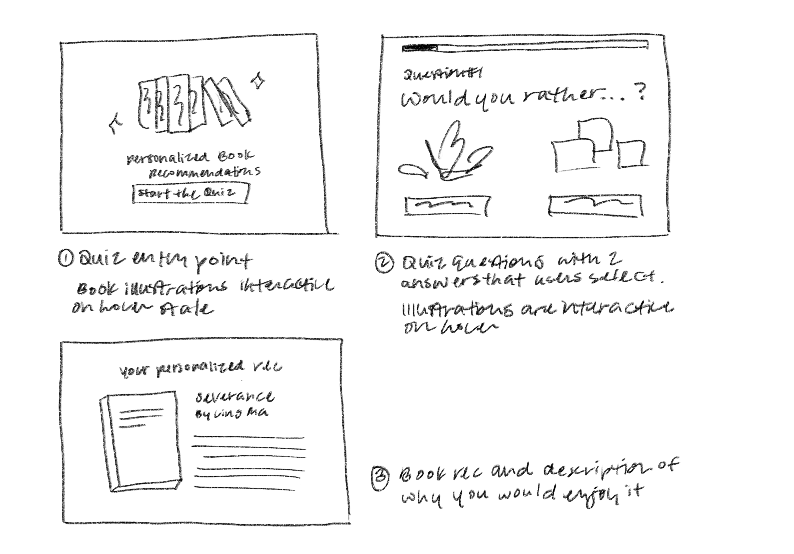
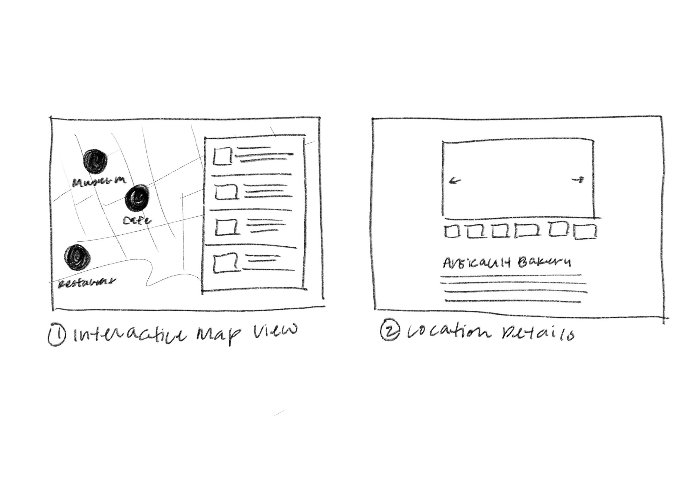
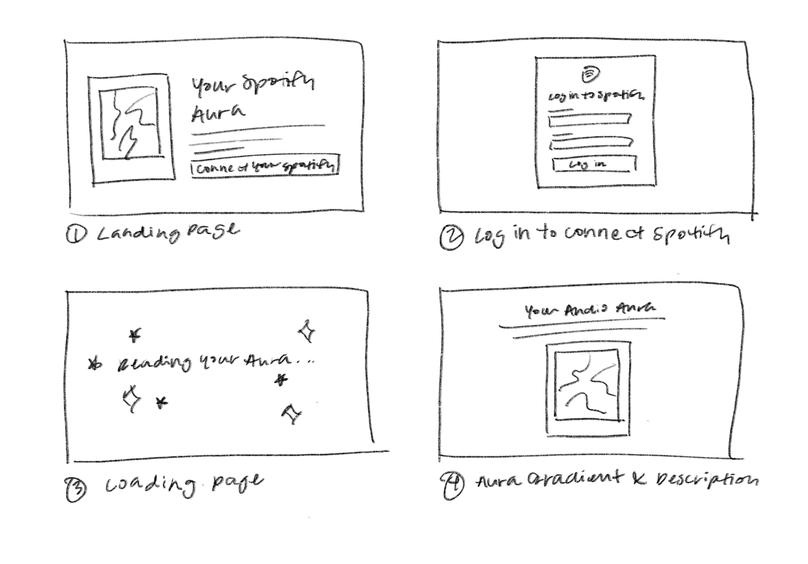

<mark>**Note that this document order from FP4 -> FP1**</mark>

<mark>Please sign up for the study</mark> at [https://tinyurl.com/pui-study](https://tinyurl.com/pui-study) to allow us to use your submission to create a better GenAI assistant for designers!

---

# **FP4 \- Final Project Writeup**

Feel free to refer to this [Markdown Cheat Sheet](https://www.markdownguide.org/cheat-sheet/) to make your writeup more organized, and you can preview your markdown file in VSCode [Markdown editing with Visual Studio Code](https://code.visualstudio.com/docs/languages/markdown#_markdown-preview). 

## Part 1: Website Description

Describe your website (300 words).

* What is the purpose of your website?   
* Who is the target audience?  
* What information do you convey with your website?   
* How is it interesting and engaging? 

## Part 2: User Interaction

How a user would interact with your website? For each step, briefly but clearly state the interaction type & how we should reproduce it.

1. Interaction type. Click on X on page Y / scroll on page X, etc.  
2. 

## Part 3: External Tool

Describe what important external tool you used (JavaScript library, Web API, animations, or other). Following the bulleted list format below, reply to each of the prompts.

1. Name of tool1  
   * Why did you choose to use it over other alternatives? (2 sentences max)  
   * How you used it? (2 sentences max)  
   * What does it add to your website? (2 sentences max)  
2. Name of tool2

## Part 4: Design Iteration

Describe how you iterated on your prototypes, if at all, including any changes you made to your original design while you were implementing your website and the rationale for the changes. (4-8 sentences max)

## Part 5: Implementation Challenge

What challenges did you experience in implementing your website? (2-4 sentences max)

## Part 6: Generative AI Use and Reflection

Describe how you used Generative AI tools to create this final project (fill in the following information, write \~500 words in total).

Document your use of all GenAI tools — ChatGPT, Copilot, Claude, Cursor, etc. using the template below. Add/Delete rows or bullet points if needed, and replace Tool1/Tool2 with the name of the tool.

### Usage Experiences by Project Aspects

Feel free to edit the column \_ (other?) or add more columns if there's any other aspect in your project you've used the GenAI tools for.

For the following aspects of your project, edit the corresponding table cell to answer:
- *Usage*: Whether you used / did not use this tool for the aspect. Enter [Yes/No]
- *Productivity*: Give a rating on whether this tool makes your productivity for X aspect [1-Much Reduced, 2-Reduced, 3-Slightly Reduced, 4-Not Reduced nor Improved, 5-Slightly Improved, 6-Improved, 7-Much Improved].

| Tool Name | Ratings | design | plan | write code | debug | \_ (other?) |
| :---- | :---- | :---- | :---- | :---- | :---- | :---- |
| Tool1 | Usage | Yes/No | Yes/No | Yes/No | Yes/No | Yes/No |
| Tool1 | Productivity | 1~7 | 1~7 | 1~7 | 1~7 | 1~7 |
| Tool2| Usage | Yes/No | Yes/No | Yes/No | Yes/No | Yes/No |
| Tool2 | Productivity | 1~7 | 1~7 | 1~7 | 1~7 | 1~7 |

### Usage Reflection

> Impact on your design and plan 
* It matched my expectations and plan in [FP2](#generative-ai-use-plan) in that … For example, 
  1. Tool1: 
  2. Tool2:
* It did not match my expectations and plan in [FP2](#generative-ai-use-plan) in that … For example, 
  1. Tool1: 
  2. Tool2:
* GenAI tool did/did not influence my final design and implementation plan because … For example, 
  1. Tool1: 
  2. Tool2:

> Use patterns
* I accepted the generations when …  For example, 
  1. Tool1: this tool once suggested … and I adjusted my design according to the suggestion because … 
  2. Tool2: 
* I critiqued/evaluated the generated suggestions by … For example, 
  1. Tool1: this tool once suggested … but I modified/rejected the suggestion because … 
  2. Tool2: 

> Pros and cons of using GenAI tools
* Pros
  1. Tool1: 
  2. Tool2:
* Cons
  1. Tool1: 
  2. Tool2:

### Usage Log

Document the usage logs (prompts and chat history links) for the GenAI tools you used. Some tools may not have an easy way to share usage logs, just try your best! Some instructions for different tools:

1. [ChatGPT](https://help.openai.com/en/articles/7925741-chatgpt-shared-links-faq) / [Gemini](https://support.google.com/gemini/answer/13743730?hl=en&co=GENIE.Platform%3DDesktop): share the anonymous link to all of your chat histories relevant to this project
2. [GitHub Copilot (VSCode)](https://code.visualstudio.com/docs/copilot/copilot-chat#:~:text=You%20can%20export%20all%20prompts%20and%20responses%20for%20a%20chat%20session%20in%20a%20JSON%20file%20with%20the%20Chat%3A%20Export%20Session...%20command%20(workbench.action.chat.export)%20in%20the%20Command%20Palette.): export chat histories relevant to this project.

---

# **FP3 \- Final Project Check-in**

Document the changes and progress of your project. How have you followed or changed your implementation & GenAI use plan and why? Remember to commit your code to save your progress.

## Implementation Plan Updates

- [ ] ...

## Generative AI Use Plan Updates

- [ ] ...

Remember to keep track of your prompts and usage for [FP4 writeup](#part-6-generative-ai-use-and-reflection).

---

# **FP2 \- Evaluation of the Final project**

## Project Description

A personal book recommendations website for my friends and family, including a list of 10 of my favorite books with a summary, my personal notes, and where to buy the book at a local bookstore.

## High-Fi Prototypes

### *Prototype 1*

**Homepage:** Users can see a list of books I recommend and filter based on various, common book themes that I enjoy. Users can also hover on each row to see the corresponding image of the book cover appear and follow the cursor.

### *Prototype 2*

**Book detail page:** Users can see a more detailed list of themes explored in the book, along with my written short summary and notes on why I recommend this book.

Summarizing the feedback I received, I mostly got notes about improving the filter/pill selection interaction and also the hover state interaction for the book list. Additionally, I got suggestions to have an additional action users can take after reading the book detail page, like where to buy it.

## Usability Test

*Discuss the user feedback you got during the evaluation / usability test (\~300 words). Indicate which feedback you implemented, inspired new directions, or otherwise influenced your final design.*

I tasked users to go through the website and test the navigation to see what they would expect to happen. I also asked users to give suggestions on additional information they want to see on the website.

One participant shared that her first instinct was to scroll and hover over elements to explore clickable options. She expected the entire row, including the text and "View" button, to change color on hover, while I only designed it to be able to click on the “View” button. I redesigned the hover interaction to change the background of the row to indicate affordance of the whole row. She also anticipated that filtering would completely narrow down the book list and that multiple selections could be made at once. From this feedback,I added the ability to make multiple selections to the pill filtering system from the homepage. Furthermore, she liked the personal notes and summary as a nice personal touch. However, she mentioned that the category pills too closely resembled the clickable pills on the homepage, so I made these unclickable pills a different color to differentiate the functionality. She also suggested adding a link to purchase the books directly, which I added at the bottom of the page.

Another participant was unclear about where information of the book tags came from. She suggested the idea of animating the book in some way to add more interactivity on the book detail page, which I plan on implementing. Like the other participant, she also suggested including the book price and where to find it, so users wouldn’t have to leave the site to search elsewhere. Furthermore, she also discussed navigation, mentioning that she would prefer the entire row to be clickable (not just the "View" button), and that making the "View" button appear only on hover could reduce repetition. She liked the row highlight effect for the filter interaction and felt it was effective to categorize the different books in the list. 

## Updated Designs

Show screenshots of your updated design based on the user feedback (\<100 words, \~2 images).

**Homepage:** To increase user freedom and flexibility of selecting different filters, I replaced the individual pill filters with a multi-select interaction, allowing users to filter the book list more easily. I implemented a hover effect where the row background changes to visually indicate that the row is clickable. Additionally, to reduce repetition and streamline the interface, I made the "View" button appear only when the cursor hovers over a row, rather than having it constantly visible.

**Book detail page:** I added links to Goodreads and a local bookstore for each book, providing users with actionable next steps to learn more or purchase the book.

## Feedback Summary

*Summarize the feedback you received in the lab session and discuss how it influenced your design (\~300 words).*

The feedback I received from my classmates during the lab session provided good insights on how I can improve the interactions on my website so that it’s more intuitive and usable. Furthermore, people also suggested helpful ways to improve the overall functionality of my website so that it is more useful for users who land on this website. 

For website interactions, one classmate noted that because the book cover image immediately following the cursor makes the cursor feel too large and obstructs the view, they suggested resizing it to improve usability. Another suggestion was to change the cursor hover interaction into a small motif from the book. Several classmates liked the personalized tags and multi-select options that I had written to describe the books because they gave a glimpse into the book's content from my perspective. They also suggested highlighting the row on hover with a slight tint to match the book cover.

For functionality, one classmate had recommended adding location-based bookstore options, possibly using Google Maps API to allow users to find local bookstores to buy books from, because I had mentioned that I wanted to avoid linking the page to buy the book on Amazon, and instead provide alternative options. When I mentioned that I was not going to go with the quiz format of the book recommendation website that I had initially proposed, they also noted a simpler way of implementing it. They liked this idea because it made the website more interactive and unique for the users visiting the website, by having users choose the vibe of an image and mapping that to a particular book recommendation instead of a complex logic quiz. Another classmate added that the quiz can also use the tags from the book detail page that I wrote to help categorize each book based on the quiz.

To address this feedback, I plan on implementing an additional feature of searching for local bookstores in your area, based on your zip code or city, to purchase the book to read if I have the time to do so. I also plan to add a bit more personalization based on the book cover to the hover state and also the individual book detail pages. Furthermore, I plan on revising the cursor hover interaction where the image follows the cursor such that the image is slightly smaller and the image isn’t immediately behind the cursor but slightly to the right, such that it does not obstruct the view of where the cursor is on the screen. 

## Milestones

*Outline weekly milestones to plan your expected implementation progress until the end of the semester (\~300 words).*

### *Implementation Plan*

- [X] Week 9 Oct 28 \- Nov 1:
  - [X] FP1 due
- [X] Week 10 Nov 4 \- Nov 8:  
  - [X] FP2 due
  - [ ] Iterate on Figma prototype and design for different breakpoints for responsive design
  - [ ] Conduct additional informal usability testing for interaction and content feedback
  - [ ] Evaluate design prototypes for accessibility
  - [ ] Start and finish basic HTML page structure: Finish homepage and book detail page
- [ ] Week 11 Nov 11 \- Nov 15: 
  - [ ] Start CSS styling: Focus on global CSS styling for consistent design system components such as navbar, buttons, pills, etc.
  - [ ] Start JS animations: Start with main interactive feature (the homepage cursor hover interactions with images following the cursor)
  - [ ] Add breakpoints for responsive design across devices
- [ ] Week 12 Nov 18 \- Nov 22:
  - [ ] FP3 due
  - [ ] Iterate on CSS styling and finalize design components: Edit and finalize global CSS styling, create CSS styling specific to the homepage and the book detail page, implement various hover states
  - [ ] Iterate on JS animations: Finish homepage hover interactions, start book detail page book image 3d hover animation with Javascript library)
  - [ ] Optional feature implementation (if time permits): Start feature for finding local bookstores or libraries based on your location/zip code/city to buy or borrow the book with Javascript library
- [ ] Week 13 Nov 25 \- Nov 29: 
  - [ ] Iterate on JS animations: Finish books detail page book image 3d hover animation, try to add microinteractions for buttons and links, also try to add additional text load animations 
  - [ ] Usability testing to evaluate bugs, interactions for different browsers, responsiveness for different devices
  - [ ] Start writing text content for all 10 book detail pages
  - [ ] Optional feature implementation (if time permits): Continue feature for finding local bookstores or libraries and style Javascript library content to match CSS of my website
  - [ ] Thanksgiving 
- [ ] Week 14 Dec 2 \- Dec 6: 
  - [ ] Finalize microinteractions and text load animations
  - [ ] Final edits: Tweak JS animations and CSS styling based on usability testing
  - [ ] Edit and finalize text content for all 10 book detail pages
  - [ ] FP4 due

### *Libraries and Other Components*

*List the JS libraries and other components (if applicable) that you plan to use.*
* GSAP: JS animation library for websites
* Three.js: 3D object
* (Optional, if time permits): Google Maps JS API: Places Library

## Generative AI Use Plan

*Outline how you plan to use Generative AI tools to aid in the implementation (\~300 words).*

### *Tool Use*

 What would you use? Edit the list given your plan. For each tool, explain briefly on what do you expect Generative AI to help you with and what might it not be able to help you with.

* ChatGPT 
  * I will use it for debugging because it can help me identify my mistakes. 
  * I will not use it for developing the structure of my code because it might not be able to help me with learning how to think of code structures on my own.
* GitHub Copilot 
  * I will use it for code suggestions and debugging because it can help me with getting unstuck or identifying my mistakes.
  * I will not use it for generating large portions of code because it might not be able to help me to develop a greater intuition and confidence of front-end development skills.

### *Responsible Use*

*How would you use Generative AI responsibly?*

I will use Generative AI as inspiration for how to come up with design solutions for code, rather than directly copy and pasting large portions of code. I will also use it to identify bugs and have it explain what I’m doing wrong so that I can learn from mistakes. I will also cite my use of Generative AI if I decide to use small snippets of code.

---

# **FP1 \- Proposal for Critique**

## Idea Sketches

### *Idea 1: Book Recommendation Quiz*

- **What is the basic idea of your final project? (1-2 sentences)**  
  - Take an interactive quiz to get book recommendations based on reviews and notes.
- **How do you plan to make your design interactive and engaging?**  
  - The quiz format creates personalized recommendations and the interactive, 3D animations will make the experience visually engaging.
- **How do you plan to make your design accessible?**  
  - Ensure that the quiz selections and 3D animations are accessible for screen readers and users of other assistive technologies.
- **What information do you specifically want to convey and include on your website?**
  - Quiz questions
  - Book information, review and description

### *Idea 2: City Guide*

- **What is the basic idea of your final project? (1-2 sentences)**  
  - Interactive map &  personal city guide to friends and family who are visiting a new city with photos and notes of each recommended local restaurants, experiences, or places to visit.
- **How do you plan to make your design interactive and engaging?**  
  - The interactive map and personal pictures provide engaging visuals for reading about local recommendations.
- **How do you plan to make your design accessible?**  
  - Ensure that the map can be interacted with using a screen reader and other assistive technologies.
- **What information do you specifically want to convey and include on your website?**
  - Map location
  - Photos
  - Notes

### *Idea 3: Spotify Aura Generator*

- **What is the basic idea of your final project? (1-2 sentences)**  
  - Link your Spotify account to see an aura visualization based on your recent Spotify listening.
- **How do you plan to make your design interactive and engaging?**  
  - The personalized aura reading and visuals of your Spotify listening makes this experience unique to each person.
- **How do you plan to make your design accessible?**  
  - Ensure that the aura visualization has alt text that can verbalize the visual interpretation of one's aura reading.
- **What information do you specifically want to convey and include on your website?**
  - Aura description
  - Aura gradient visualization

## Feedback Summary

*Summarize all the critiques you received during the lab session (\~300 words).* 

### Book Recs Quiz
From the group critique, I got advice on incorporating JavaScript libraries and APIs for 3D animations. For accessibility purposes, I learned that I can include a static version of the page alongside the animated one. Prioritizing an MVP here is crucial, as for the timeline of this project having 3D animations on the website may be more engaging but more time-consuming to implement.For the book information database, a JSON file could serve as a sufficient database if I scope it down to just my own personal book recommendations, or sourcing an existing dataset.

### Personal City Guide
From the group critique, a classmate who took a class on accessibility mentioned that implementing tagging on the backend can significantly help with accessibility for users. Furthermore, I need to consider the scope of the city guide, such as if it is intended for a single city and if the audience is just shared to friends and family. Another approach suggested during the group conversation was about adding a feature that allows users to make plans within the app to make it more engaging. One critique was to avoid modeling the guide too closely after Google Maps, as a unique approach would be more beneficial for the final project.

### Spotify Aura Generator
From the group critique, it was suggested that to reduce complexity, I can narrow the project’s scope to a list of 10 songs for aura creation. Another way to reduce complexity is to limit the aura options to three types. Although Spotify’s API is public, one comment was that they were unsure of what specific information you can use to infer and map to aura types. Furthermore, because this is inspired by a previous Spotify Wrapped feature, it could be worth exploring how to take this idea in a different direction to make it a unique concept.

## Feedback Digestion

*Digest the feedback you got in the lab (\~300 words). Indicate which critique you will act on in your next design and why you chose to incorporate/dismiss pieces of critique.*

Based on the feedback I got in lab, the **Book Recs Quiz** emerged as a unique and manageable project. Recommendations to incorporate JavaScript libraries and APIs for 3D animations are valuable, but it’s essential to prioritize accessibility if I decide to use 3D animations. To address this, I will provide a static version of the page alongside any animations, ensuring that all users can engage with the content. Developing a MVP of my website, such as without the 3D animations, for the sake of the semester timeline would also streamline the development timeline and effort.

Using a JSON file as a database for personal book recommendations was suggested as a sufficient approach. This will help reduce complexity and align with my goal of creating a distinctive, personalized experience in a crowded market. Implementing backend tagging can further enhance accessibility, allowing users to navigate the quiz with screen readers and other assistive technologies.

For the **Personal City Guide**, feedback highlighted the importance of clarifying the project scope, such as whether it will focus on a single city and how it will be shared with friends and family. Adding a feature that enables users to plan activities within the app would increase engagement and also emphasize the individualized aspect of personal images and notes, while avoiding a design too similar to Google Maps will ensure a unique website experience. However, I decided not to move forward with this concept because its functionality could be implemented using Google Maps, although my idea is a more personalized, shareable version.

For the **Spotify Aura Generator**, the suggestion to narrow the project’s scope to a smaller list of songs and smaller number of aura types. Although the Spotify API offers public access, exploring how to creatively infer and map aura types will be essential to differentiate this project. I’ve decided to not pursue this idea because of its complexity of implementation, such as with inference and creating unique SVG gradients, and lack of originality compared to my other ideas.

For my final project, I’ll primarily focus on the **Book Recs Quiz** while also integrating feedback into the other two projects, so that I prioritize feasibility, accessibility, engagement, and uniqueness.

